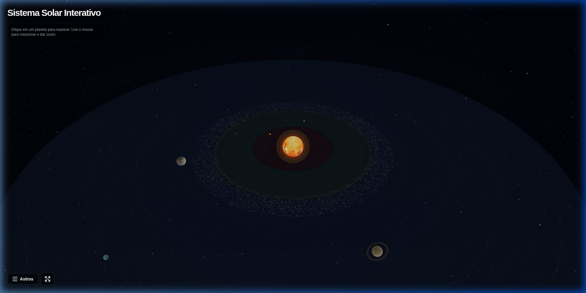
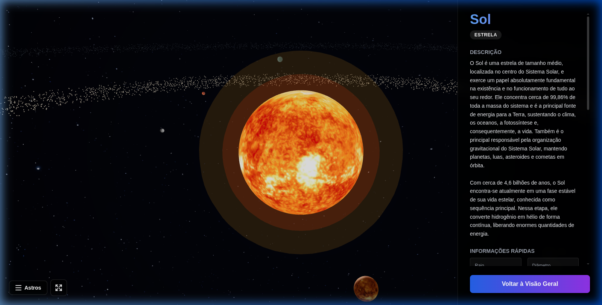
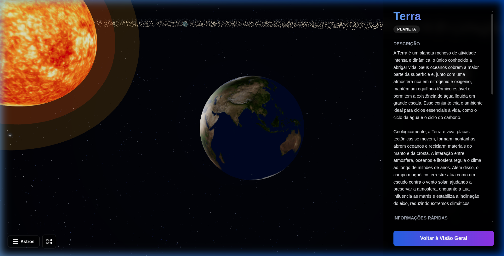
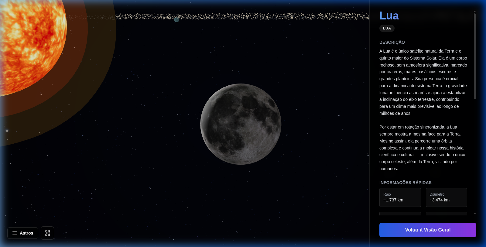
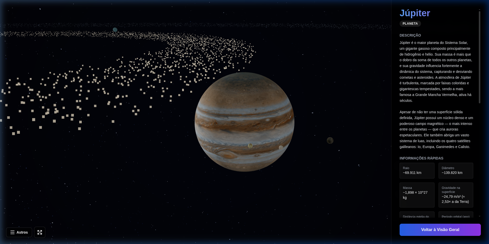

<div align="center">

# 🌌 Cosmic Explorer: Sistema Solar 3D

Veja o projeto em ação: https://felipedpaula.github.io/solar-system/

Um simulador interativo em 3D do nosso Sistema Solar, permitindo que você explore planetas, luas e muito mais diretamente no seu navegador!

[](https://github.com/felipedpaula/solar-system/actions/workflows/deploy-pages.yml)

<p align="center">
  <em>Desenvolvido com o auxílio do <b>Antigravity - Gemini 3.1 High</b> (Spec-driven Development).</em>
</p>

</div>

---

## ✨ Astrolábio Digital

Veja abaixo a beleza do espaço que você pode explorar iterativamente em 3D:

<div align="center">
  
</div>
<br/>
<div align="center">
  
  
</div>
<br/>
<div align="center">
  
  
</div>

---

## 🚀 Funcionalidades Principais

- **Visualização 3D Imersiva:** Modelos 3D realistas dos corpos celestes renderizados diretamente com WebGL.
- **Navegação Dinâmica:** Clique em planetas e luas, ou utilize o menu inteligente **"Astros"** para viagens de câmera com zoom suave até a órbita de cada astro.
- **Conteúdo Educacional Baseado em IA:** Apresenta dados precisos e envolventes sobre os corpos que você visita, potencializado com integrações de dados.
- **Design Totalmente Responsivo:** Arquitetado desde interfaces Desktop a Mobile, adaptando harmonicamente controles de navegação e componentes em Tela Cheia.

---

## 💻 Tecnologias Utilizadas

Este projeto foi construído utilizando tecnologias modernas para desenvolvimento Frontend, com um forte foco em performance 3D e interfaces modernas:

- **[React 19](https://react.dev/)** - Biblioteca principal para criação da interface e lógica de UI.
- **[Three.js](https://threejs.org/) & [@react-three/fiber](https://r3f.docs.pmnd.rs/getting-started/introduction)** - Abstração e renderização das malhas 3D espaciais em telas web.
- **[@react-three/drei](https://github.com/pmndrs/drei)** - Auxiliares vitais para câmeras e controles de WebGL prontos para o uso.
- **[GSAP](https://gsap.com/)** - Utilizado para animar fluidamente o posicionamento do observador e câmeras tridimensionais.
- **[Vite](https://vitejs.dev/)** - Responsável pelo bundle ultrarrápido da aplicação.
- **[Tailwind CSS](https://tailwindcss.com/)** - Estilização prática e responsiva em utilitários de alta performance.

---


## 🌐 Deploy no GitHub Pages

O projeto está configurado para deploy automático via **GitHub Actions** na branch `master`.

- Workflow: `.github/workflows/deploy-pages.yml`
- Build de produção: `npm run build` (Vite gera em `dist/`)
- URL pública: **https://felipedpaula.github.io/solar-system/**

Para publicar manualmente, rode o workflow **Deploy to GitHub Pages** em `Actions` (gatilho `workflow_dispatch`) ou faça push na branch `master`.

---

## ⚙️ Como rodar localmente

Siga estas etapas para ter o simulador rodando em sua própria máquina:

**Pré-requisitos:** Node.js

1. **Instale as dependências:**
   ```bash
   npm install
   ```

2. **Inicie o servidor de desenvolvimento:**
   ```bash
   npm run dev
   ```

A aplicação abrirá localmente de imediato. Boa exploração pelo cosmos! 🛸
